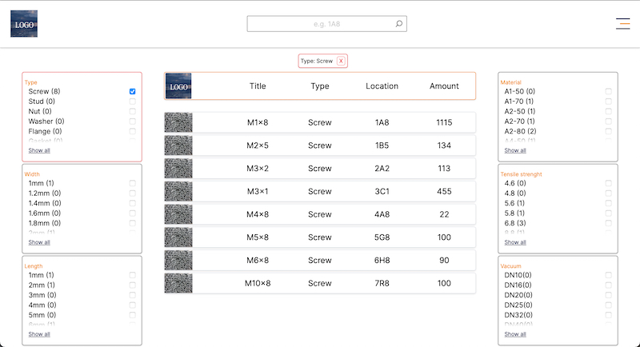
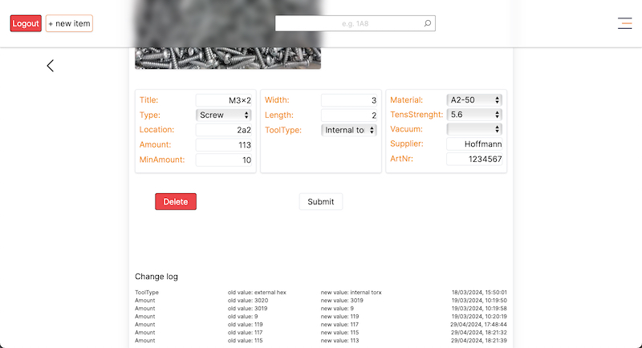

A storage app for consumables.
 

 

In admin mode you can add and update items and see the changelog of each item.
 

 
 
NextJS, MongoDB, Recoil, TailwindCSS, Nodemailer, Darkmode, responsive

### This is a [Next.js](https://nextjs.org/) project

after cloning:

run: npm i

run: npm run dev / yarn dev / pnpm dev / bun dev to start the server

Open [http://localhost:3000](http://localhost:3000) with your browser to see the result.

You can start editing the page by modifying `app/page.js`. The page auto-updates as you edit the file.
